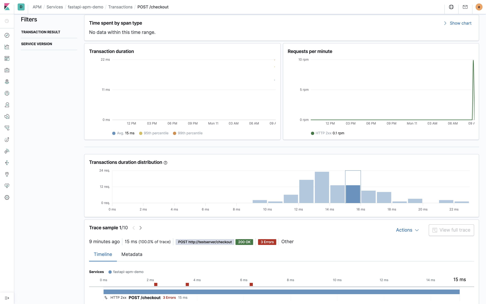

# TODO
1. Change `main.py` so that loggs are printed to a file using `structlog` https://www.structlog.org/en/stable/
2. Create a Filebeat config referencing that file https://www.elastic.co/blog/structured-logging-filebeat
3. Create a docker-compose file for the App + Fileneat + Elk
4. Create a `Make` target for sending data to the API via `bash`

	- 


1. Create a branch for Elastic Cloud
2. Pip install https://github.com/eht16/pylogbeat/
3. Screenshot how to configer

1. 

## Roadmap
Vision:
> Deploy a modern `fastapi` API template app with build in preformance monitoring and error logging using `elastic APM`, with the press of a button using AWS `CloudFormation`. 

- [x] Integrate fast API middlware for APM logging
- [x] docker-compose for ELK and APM stack
- [x] Example endpoints and data
- [x] Tests in pytest
- [x] Add logstash support, and correlate transactions/requests with logs. 
- [ ] Add codeship support and system tests
- [ ] Cloudformation template for FastAPI and ELK. 
- [ ] Add a Launch Stack AWS button to the API
- [ ] Create a Elastic search example endpoint in fast API 
- [ ] Perhaps switch to `python-logstash-async` for async communication. 

## Introduction

This project aims to show how APS logging and dashboard can be integrated with the excelent `fastAPI` framework created by my personal hero [tiangolo](https://github.com/tiangolo), and the `ELK` stack is using docker-compose images from [docker-elk](https://github.com/deviantony/docker-elk) by deviantony. 

Backend related projects will always integrate some essential services, e.g.:

- Sentry for logging [cost](https://sentry.io/pricing)
- Newrelic for performance monitor, see [cost](https://newrelic.com/application-monitoring/pricing)
- APS and the ELK stack, it's open-source and **free**

From the elastic [website](https://www.elastic.co/observability)
> Bring your logs, metrics, and APM traces together at scale in a single stack so you can monitor and react to events happening anywhere in your environment. And it's free and open.


## Getting started

This project is a demo to show feature and usage of elastic apm, based on docker and flask.

1. Install dependencies. 
```
make local-setup-environment
```

2. Run EKS dashboard and fastAPI service. 
```
make local-run
```

3. Create index patterns for `logstash` and `apm` in `kibana`. Make sure to only run the comands after the previous command has been fully executed. 
```
make local-create-index
```

4. Send some data to the API:
```
for i in $(seq 100); do http :8000/checkout email="${i}@email.domain" username="${i}" cost_spend="${i}" item_count="1"; done
```
or simply run pytest
```
pytest
```

5. See preformance metrics and logging in `Kibana`. 
```
http://localhost:5601/app/kibana
```
The stack is pre-configured with the following privileged bootstrap user:

- **user**: *elastic*
- **password**: *changeme*

See the response time of your latest requests by navigating to http://localhost:5601/app/apm#/services/fastapi-apm-demo/transactions. In APM, requests are called `transactions`, and each transaction will have a `transaction.id`. 



See all error messages for your transactions by navigating to http://localhost:5601/app/apm#/services/fastapi-apm-demo/errors


See the output of your python `logger` by navigating to: http://localhost:5601/app/infra#/logs/stream . If you want to correlate your logs with your transactions (i.e. requests) you can do this through the `transaction.id` property in the logs. You can moreover add `transaction.id` as a logs steam column by going to: http://localhost:5601/app/infra#/logs/settings


### Modification done to docker-elk
> IMPORTANT: These modifications are already done in the repo by default. This is just an FYI in case you want to fork the project and use a newer version of the `docker-elk`. 

As previously mentioned, the directory `docker-elk` is just an exact copy of the [docker-elk](https://github.com/deviantony/docker-elk) project, that contains `docker-compose` files for creating the `ELK` stack. 

However the following two rows are added to `kibana.yml` to make the `logstash` logs in fastapi detectable inside `Kibana`.
```
xpack.infra.sources.default.logAlias: logstash-*,default-logs-*,filebeat-*,kibana_sample_data_logs*
xpack.infra.sources.default.metricAlias: logstash-*,metricbeat-*
```

And added replaced the `logstash.conf` file with the following pipeline to support `python-logstash-async`.
```
input {
	udp {
		port => 5000
		codec => json
	}
}
output {
	elasticsearch {
		hosts => "elasticsearch:9200"
		user => "elastic"
		password => "changeme"
		codec => rubydebug
	}
}

```
### Reference
- [APM overview](https://www.elastic.co/guide/en/apm/get-started/7.6/index.html)
- [Fast API support | APM Python Agent](https://www.elastic.co/guide/en/apm/agent/python/master/starlette-support.html)

```
sudo docker run -p 5601:5601 -p 9200:9200 -p 5044:5044 -it --name elk sebp/elk
#http://localhost:5601/
curl -L -O https://artifacts.elastic.co/downloads/apm-server/apm-server-7.6.1-amd64.deb
dpkg -i apm-server-7.6.1-amd64.deb
service apm-server start
```